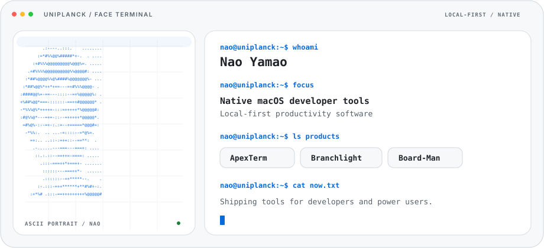
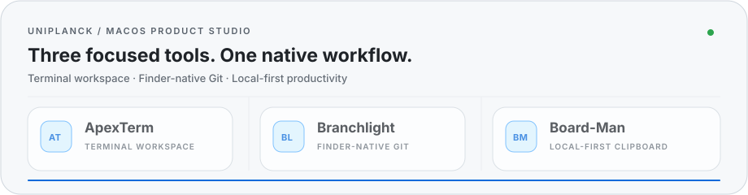

<a href="#featured">
  <picture>
    <source media="(max-width: 600px)" srcset="assets/nao-terminal-hero-mobile.svg">
    
  </picture>
</a>

# Uniplanck

### Native macOS tools for developers and power users.

Terminal workflows · Finder-native Git · local-first productivity

I design and ship focused macOS software in Swift. The public work here centers on three products built for fast, practical daily workflows.

  

## Now shipping

  

Current focus: tightening native workflows across the terminal, Finder, and clipboard while keeping the software fast, local, and native.

## Featured

### [ApexTerm](https://github.com/uniplanck/ApexTerm)

**Native macOS terminal workspace.** Fast tab and nested-pane navigation, command transcripts, Universal Search, Command Timeline, tmux sessions, remote-host profiles, configurable shortcuts, and optional agent-assisted workflows.

`Swift` · `macOS` · `Terminal` · `tmux`

### [Branchlight](https://github.com/uniplanck/Branchlight)

**Git belongs in Finder.** Finder status badges and context actions backed by a native Git client for staging, structured diffs, selected-line staging, history, blame, stashes, branches, worktrees, and remote operations.

`Swift` · `AppKit` · `SwiftUI` · `Finder Sync`

### [Board-Man](https://github.com/uniplanck/boardman)

**Local-first clipboard and text workflow for macOS.** Clipboard history, reusable Templates, pins, search, image previews, usage signals, and keyboard-driven pasting, with working data kept on the Mac.

`Swift` · `AppKit` · `Local-first`

## About

**Building Uniplanck. Designing native macOS tools.**

I build small native products around repetitive friction: commands that take too many windows, Git actions that should live beside files, and text workflows that should stay local.

  

## Open source

ApexTerm, Branchlight, and Board-Man are public projects. Issues and pull requests are welcome; focused changes with a clear problem statement are easiest to review.

**[uniplanck.com](https://uniplanck.com)** · [ApexTerm](https://github.com/uniplanck/ApexTerm) · [Branchlight](https://github.com/uniplanck/Branchlight) · [Board-Man](https://github.com/uniplanck/boardman)

<table>
  <tr>
    <td><code>STATUS</code> · <code>NATIVE macOS</code> · <code>DEVELOPER TOOLS</code> · <code>LOCAL-FIRST</code> <code>BUILT BY NAO YAMAO</code> · <code>APEXTERM</code> / <code>BRANCHLIGHT</code> / <code>BOARD-MAN</code></td>
  </tr>
</table>
